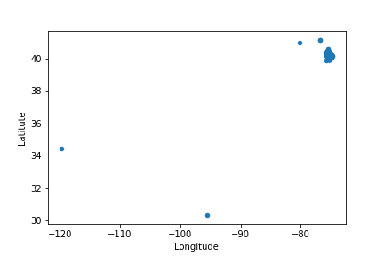
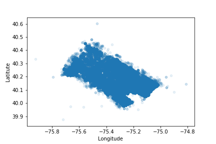
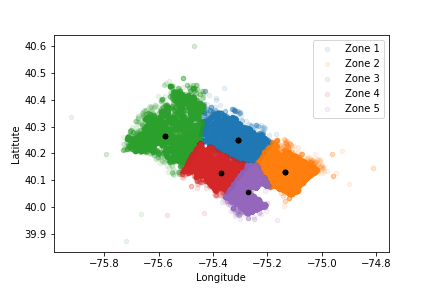

# Results

## Task 1 - Project management

As a manager I would start with a kickoff meeting putting the whole team up to speed, first giving an overview of the task in hand, then delegating tasks as follows:

_Database engineers_ would verify the integrity and completeness of the data received from the client and come up with a solution for storing it so that the Data Scientist would be able to easily query it afterwards. 
_Data Scientists (DS)_ would select tools and methods to solve the task in hand and provide feedback to the Database Engineers concerning pre-processing of data and formatting. Depending on the specializations of each DS (image processing, natural language processing, etc.), subtasks would be divided and handed to the corresponding person or subgroup. 
_Visualization specialists_ would be in charge of outlining a first draft of the final report to the client. Usually the type of outcome of such projects is known (e.g. location of emergency stations on a map, working schedule of call centre staff), so the format can be prepared beforehand. They would
also be in charge of informing the DS group about the required format of data (output from ML algorithms) for plotting and reporting.

Once the team has agreed on the streamline of data, each member can start working on their own part of the project. Daily stand-up meetings with all team members would insure that the workflow is at a healthy pace. Moreover, any blockers can be quickly addressed and feedback to the client can be maintained up-to-date.

### Suggestion of solutions and directions

For both high- and low-level views of project workflow I would use a management tools such a Trello. The proposed task seems simple enough not to require more complex solutions such as JIRA or MS Project.

Data can be stored and handled in the _Google Cloud Platform_: _Bigquery_ is a simple yet powerful solution for storing and querying databases, while _Datalab_ uses an environment similar to _Jupyter notebooks_ and provides integration with _TensorFlow_.

Reporting to the client could ideally be done via _Tableau_, _PowerBI_ or _Qlik Sense_. However, for a flexible, interactive and free solution, _Plotly_ could be used instead, directly from _Datalab_.

## Task 2 - Rescue stations in zombie apocalypse

### Methodology
The task being to determine the location of emergency stations based on 911 call logs, I have decided to use a clustering algorithm to solve the problem. This method will allow me to position the stations as the centroids of clusters so that the distance to the reported incidents is minimized. KMeans clustering will a) assume that the variance of the distribution is spherical and b) that each cluster has roughly the same number of observations. The first (a) will not be a perfect approximation to the dataset distribution, since these are points on a map, which will not necessarily follow a specific pattern. However, (b) is a good characteristic to take advantage of, since all stations will have the same size and capacity, so evenly distributing the incidents between them would be ideal.

The tools used will be: Python running on Jupyter notebooks with the libraries pandas, numpy, sklearn, matplotlib and geopy.

### Exploratory Data Analysis
The data provided contains 299809 instances and 8 features. The column “e” is irrelevant, since it contains a single value (1) for all instances. 
There are a total of 148433 instances containing “EMS”, including 5 in the category “Fire: EMS SPECIAL SERVICE”. The later will be kept in the dataset of interest, since it probably indicates support to EMS by the Fire Department. 
The columns “zip” are “timeStamp” can be useful for the validation of data, e.g. confirming that an instance contains correct information, as discussed below, but will not be relevant for the rest of the process. 
The “twp” column contains township data with missing values. Township is also present in the “desc” column, which is complete. We will replace “twp” by the townships occurring in the “desc” column. 
Using geopy we will also have a quick check at the integrity of the “lat” and “lng” columns, as compared to the “twp” column. Most of the latitude/longitude pairs match the township. The nonmatching values seem to contain neighbouring townships, which do not constitute a problem for this analysis.

The leftmost point in Figure 1a indicates coordinates for Texas, while the other instances occur around the eastern part of the state of Pennsylvania. It is probably human error and will thus be removed from the dataset. 
The two other instances located northwest of the main group will also be removed. While these can
be correct instances, they would hinder the positioning of the emergency stations due to their large
distance from the main area. In the event of a zombie apocalypse, I would rather focus on the most
immediate and reasonable cases than on few, isolated cases for the problem at hand.
Figure 1b shows the distribution of EMS occurrences after the removal of outliers.

### Clustering
A quick analysis at the average distance between stations and incidents using different numbers of of stations (the Elbow method was used here) indicates that 5 stations is indeed around the ideal number of stations for this case. This would obviously take into account only the return-oninvestment part, not the interest of the population in a crisis.

### Clustering – 5 stations
Applying the clustering algorithm to the dataset with 5 stations yields the result shown in Figure 2, below. This looks like a reasonable result, since the upper area contains a lower density of incidents, so it attaches a larger area to the corresponding station. The stations are also observed to be near the spatial centre of their regions, or leaning towards zones of local higher incident density.

The coordinates for the stations are:
[-75.30999407, 40.24927146], [-75.2720792 , 40.05525038], [-75.57876684, 40.26675471], [-75.13502152, 40.12882037], [-75.37350408, 40.12924474]

### Prospects – if I had more time
- Investigate available literature for the most adapted solution for the problem. Positioning emergency stations (and similar problems) is an important problem and has been thoroughly discussed for years. Many articles are available using different approaches for this problem, based on the initial conditions of the system and the required output.
- Compare the results above with those that could be obtained using a hierarchical clustering algorithm or different methods that could be useful for this case.
- If this was a real analysis (\*knocks on wood for not having to witness a zombie
apocalypse\*) I would be glad to delve into the ethical discussions about how to deal with the data and up to which point we can let this analysis contribute to the decision.